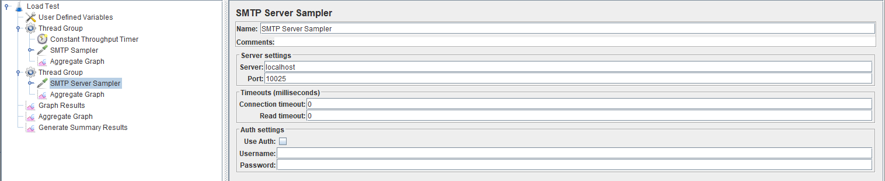

# jmeter-smtp-server-plugin
> SMTP server plugin for JMeter.

[](https://app.codacy.com/app/git_29/jmeter-smtp-server-plugin?utm_source=github.com&utm_medium=referral&utm_content=zvecr/jmeter-smtp-server-plugin&utm_campaign=Badge_Grade_Dashboard)
[](https://travis-ci.org/zvecr/jmeter-smtp-server-plugin)

Self contained, pure java SMTP server hosted directly within JMeter. Aligned with the default `SMTP sampler`, the plugin provides support for various configuration including SMTP auth and TLS.

Removes the requirement of a POP3 or IMPS intermediate server when load testing SMTP receiving.

Ideal for load testing SMTP MITM proxies, the plugin allows for the following setup:
```
+---------+      +---------+      +---------+
|         |      |         |      |         | 
| JMeter  |      |  SMTP   |      | JMeter  |
|  SMTP   |----->|  Proxy  |----->|  SMTP   |
| sampler |      |         |      | server  |
|         |      |         |      |         |
+---------+      +---------+      +---------+
```

**Note:** This plugin currently targets **JMeter 5.1** onwards.

## Example Usage



See [examples](./examples/) folder for .jmx examples

## Installation

For an automatic Maven based solution, see examples folder on how to utilise `jmeter-maven-plugin`.

### Manual

1. Download JMeter >= 5.1
2. Copy jar to plugin folder

## Development Setup

For a quick-start, the provided `Vagrantfile` can provision an environment easily without major changes to your primary operating system.

To build the virtual environment:

```sh
vagrant up
vagrant ssh
```

### Manual
Dependencies required:
- Java 1.8
- Maven >= 3.5.0
